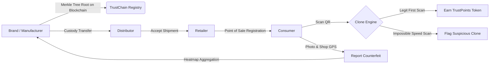
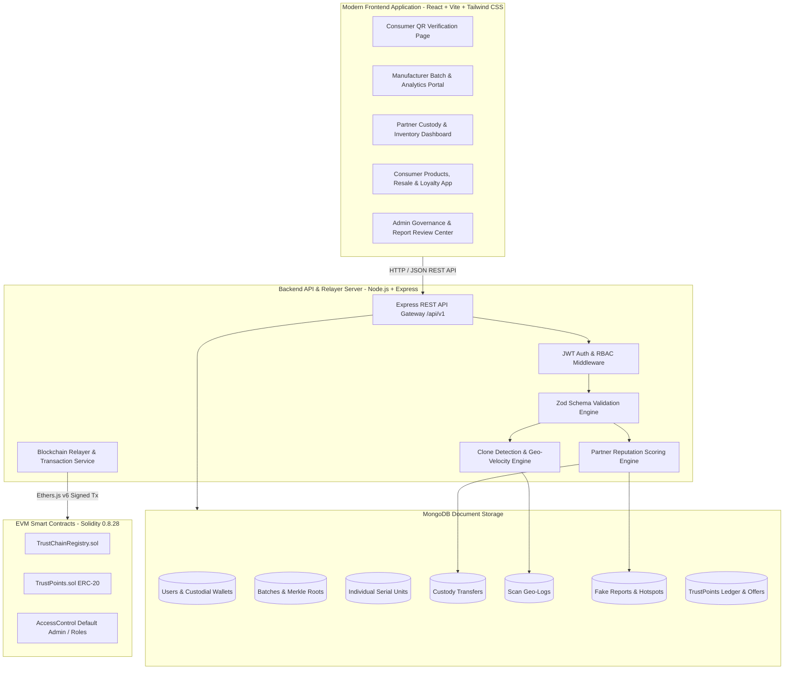
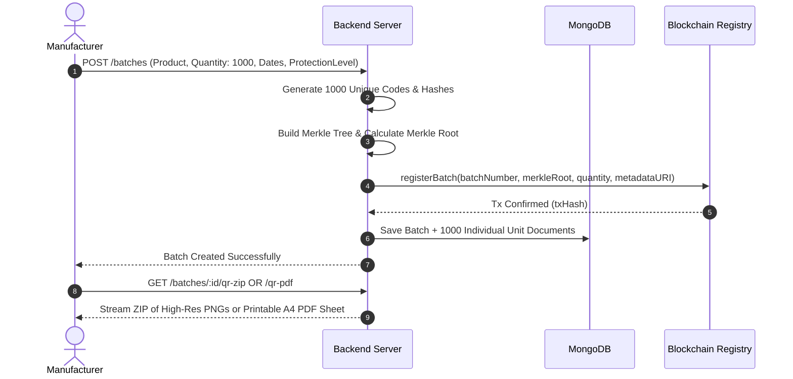
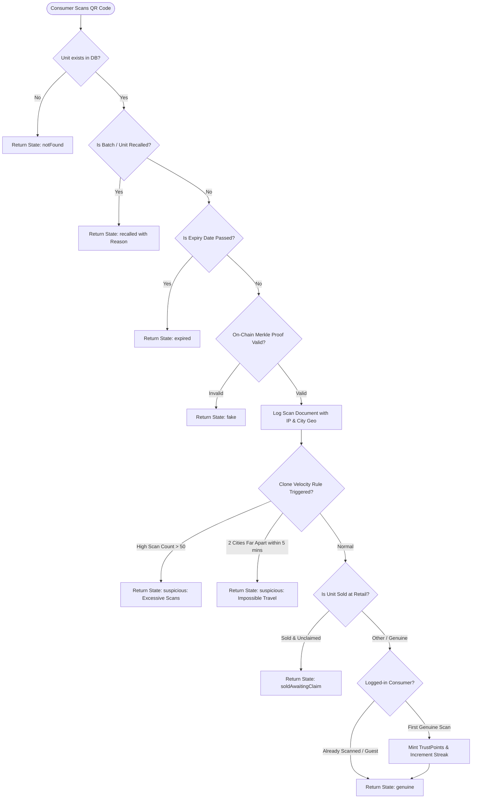
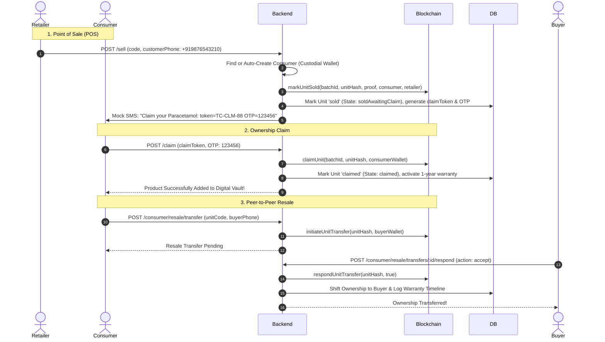

# 🛡️ TrustChain: Next-Gen Blockchain Product Authentication & Supply Chain Provenance Platform
## 🌟 Master System Walkthrough & Architectural Deep-Dive

> [!IMPORTANT]
> **TrustChain** ek enterprise-grade decentralized supply chain, anti-counterfeit verification, aur consumer engagement platform hai. Ye fake products, duplicate QR codes, black-market tampering, aur supply chain fraud ko mathematically aur cryptographically eliminate karta hai through **Ethereum/EVM Smart Contracts**, **Merkle Tree Proofs**, **Gasless Relayer Wallets**, and **Real-Time Geo-Velocity Anomaly Detection**.

---

## 📑 Table of Contents

1. [Platform Overview & The Problem It Solves](#1-platform-overview--the-problem-it-solves)
2. [End-to-End System Architecture](#2-end-to-end-system-architecture)
3. [Core Pillars & Subsystems Breakdown](#3-core-pillars--subsystems-breakdown)
   - [Pillar 1: Smart Contracts & Web3 Gasless Architecture](#pillar-1-smart-contracts--web3-gasless-architecture)
   - [Pillar 2: Manufacturing, Merkle Batches & QR Streaming](#pillar-2-manufacturing-merkle-batches--qr-streaming)
   - [Pillar 3: Supply Chain Custody Transfers](#pillar-3-supply-chain-custody-transfers)
   - [Pillar 4: Public Verification & Clone/Velocity Engine](#pillar-4-public-verification--clonevelocity-engine)
   - [Pillar 5: Retail Sale, Digital Warranty & P2P Resale](#pillar-5-retail-sale-digital-warranty--p2p-resale)
   - [Pillar 6: Loyalty Rewards & Gamification Engine](#pillar-6-loyalty-rewards--gamification-engine)
   - [Pillar 7: Counterfeit Reporting & Hotspot Intelligence](#pillar-7-counterfeit-reporting--hotspot-intelligence)
   - [Pillar 8: Manufacturer Analytics & Partner Reputation System](#pillar-8-manufacturer-analytics--partner-reputation-system)
   - [Pillar 9: Manufacturer Billing, Plans & Prepaid Invoices (INR)](#pillar-9-manufacturer-billing-plans--prepaid-invoices-inr)
   - [Pillar 10: Organization Settings, Team Roles & Alerts](#pillar-10-organization-settings-team-roles--alerts)
   - [Pillar 11: Admin Governance, User/Brand Suspension & Platform Analytics](#pillar-11-admin-governance-userbrand-suspension--platform-analytics)
4. [The "Golden Path" Lifecycle Story (Step-by-Step)](#4-the-golden-path-lifecycle-story-step-by-step)
5. [User Roles & Permissions Matrix](#5-user-roles--permissions-matrix)
6. [Quickstart Guide: Running the Whole Ecosystem](#6-quickstart-guide-running-the-whole-ecosystem)
7. [Demo Test Data, Pre-Seeded Accounts & QR Codes](#7-demo-test-data-pre-seeded-accounts--qr-codes)

---

## 1. Platform Overview & The Problem It Solves

### ❌ The Real-World Supply Chain Crisis
- **Counterfeit Market**: Fake pharmaceuticals, luxury goods, auto parts, aur packaged foods ke chalte har saal billions of dollars ka nuksan hota hai aur logon ki jaan khatre mein padti hai.
- **Dumb QR Codes**: Traditional QR codes static hote hain. Ek fraudster ek genuine code ko photo kheench kar hazaron nakli dabbo par chipka deta hai, aur regular scanner use 'genuine' dikhata hai.
- **Broken Chain of Custody**: Brands ko pata hi nahi hota ki unka maal kis distributor ya retailer ke paas kab gaya aur kahan leak hua.
- **Consumer Disconnect**: Consumer ko verification ka koi incentive nahi milta aur brand ko ground-level counterfeit reports nahi milte.

### 💡 The TrustChain Solution


- **Gasless Web3 Experience**: End-users, retailers, ya distributors ko crypto wallets (MetaMask), private keys, ya gas fees (ETH) ki zarurat nahi hai. Backend **Relayer Service** automatically on-chain transactions execute karta hai.
- **Merkle Tree Efficiency**: 100,000 units ke individual serial numbers store karne ke bajaye, sirf ek 32-byte ka **Merkle Root** blockchain par jata hai. Instant verification without sky-high gas fees.
- **Cryptographic Ownership**: Factory gate se lekar consumer ki pocket aur future resale tak har custody change cryptographically recorded hoti hai.

---

## 2. End-to-End System Architecture



---

## 3. Core Pillars & Subsystems Breakdown

### Pillar 1: Smart Contracts & Web3 Gasless Architecture

Smart contracts system security aur immutability ka foundation hain:

1. **`TrustChainRegistry.sol`**:
   - **Role Management**: `DEFAULT_ADMIN_ROLE`, `MANUFACTURER_ROLE`, `PARTNER_ROLE`.
   - **Batch Registration**: Manufacturer batch metadata hash aur `merkleRoot` register karta hai.
   - **Cryptographic Verification**: `verifyUnit(batchId, unitHash, merkleProof)` checks if unit exists in the batch without storing all units on-chain.
   - **Batch Custody Transfers**: `initiateBatchTransfer(...)` and `respondBatchTransfer(...)` record institutional custody changes.
   - **Retail Sale**: `markUnitSold(batchId, unitHash, proof, consumerWallet, retailerWallet)` sets ownership state on-chain.
   - **Consumer Claims & P2P Resale**: `claimUnit(...)`, `initiateUnitTransfer(...)`, and `respondUnitTransfer(...)`.
   - **Product Recall**: `recallBatch(batchNumber, reason)` immediately revokes batch on-chain.

2. **`TrustPoints.sol` (ERC-20 Token)**:
   - Platform loyalty reward token (`Symbol: TP`, `Decimals: 18`).
   - Manufacturer authorized address tokens mint kar sakta hai genuine scans aur approved fake reports par reward dene ke liye.
   - Token burn method (`burnFrom`) coupons redeem karne par call hota hai.

3. **Custodial Wallet & Relayer Engine**:
   - Har naye partner, retailer ya consumer ke liye system securely ek **custodial Ethereum wallet** generate karta hai (`AES-256-GCM` encrypted private keys).
   - Saare on-chain state updates **Relayer Private Key** ke through gas sponsor karke broadcast hote hain via [`transaction.service.js`](file:///c:/Users/ghosh/OneDrive/Desktop/obsidian/backend/src/services/transaction.service.js) with nonce retry & status tracking.

---

### Pillar 2: Manufacturing, Merkle Batches & QR Streaming



- **Merkle Tree Computation**: Har unit ka standard leaf structure hota hai: `keccak256(bytes(unitCode))`. Root contract mein permanently save ho jata hai.
- **Double Protection Level**:
  - `Standard`: Fast high-volume serialization.
  - `HighValue`: Extra cryptographic salts + individual proof payload caching.
- **Production QR Code Generation**:
  - **ZIP Export**: High-resolution 300 DPI transparent QR code PNGs for industrial packaging printers.
  - **Printable PDF Export**: Auto-paginated A4 grid with product name, batch ID, serial number, and scannable QR.
- **Emergency Product Recall**:
  - Endpoint: `POST /api/v1/batches/:batchId/recall` with reason.
  - Calls `recallBatch` on-chain.
  - Database mein batch aur **saari linked units** ka status instant `'recalled'` mark karta hai.

---

### Pillar 3: Supply Chain Custody Transfers

Maal factory se consumer tak direct nahi jata; multiple intermediaries (National Distributor -> Regional Distributor -> City Retailer) se pass hota hai.

```mermaid
stateDiagram-v2
    [*] --> Pending : Sender creates transfer (on-chain initiateBatchTransfer)
    Pending --> Accepted : Recipient accepts (on-chain respondBatchTransfer true)
    Pending --> Rejected : Recipient rejects with reason (on-chain respondBatchTransfer false)
    Accepted --> [*] : Units custody shifted to recipient PartnerInventory
    Rejected --> [*] : Custody remains with sender; incident logged in reputation
```



- **Institutional Validation**:
  - Sender partner aur recipient partner dono platform-approved hone chahiye.
  - Sender ke paas required quantity ka in-stock balance hona mandatory hai.
- **Strict Rejection Reason Requirement**:
  - Agar carton damaged hai, seal tooti hai ya count mismatch hai, toh recipient bina valid reason ke reject nahi kar sakta. Rejection audit trail mein store hoti hai.
- **Partner Inventory Ledger**:
  - Har partner ka inventory real-time grouped by batch track hota hai (`inStock`, `totalReceived`, `totalTransferredOut`, `expiryDate`).

---

### Pillar 4: Public Verification & Clone/Velocity Engine

Public QR scan (`GET /verify/:code`) TrustChain ka sabse powerful engine hai.



#### 🛡️ Clone Detection Algorithms:
1. **Excessive Scan Frequency (Hotspot Threshold)**:
   - Ek genuine single product 10-15 bar scan ho sakta hai (family members). Agar scan count threshold (e.g. 50) cross karta hai, it indicates someone copied the QR code on thousands of counterfeit packages.
2. **Impossible Geo-Velocity (Speed Anomaly)**:
   - Agar same unit code 12:00 PM par **Mumbai** mein scan hua, aur 12:03 PM par **Delhi** mein scan hua (1,400 km apart in 3 minutes), system turant `suspicious` flag karta hai:
   - *"Impossible travel: Scanned in Mumbai and New Delhi within 3 minutes"*.
3. **Simulation Header for Testing**:
   - Postman ya Browser testing ke liye `x-simulate-city: Mumbai` ya `?city=Delhi` pass karke geo-velocity live test ki ja sakti hai!

---

### Pillar 5: Retail Sale, Digital Warranty & P2P Resale



---

### Pillar 6: Loyalty Rewards & Gamification Engine

Consumers ko genuine verification ke liye reward dekar network security crowdsource hoti hai:

```
                  ┌────────────────────────────────────────┐
                  │          TrustChain Gamification       │
                  └───────────────────┬────────────────────┘
                                      │
          ┌───────────────────────────┼───────────────────────────┐
          ▼                           ▼                           ▼
┌──────────────────┐        ┌──────────────────┐        ┌──────────────────┐
│ First Scan Point │        │ Daily Streak     │        │ Referral Program │
│ +10 Points       │        │ Day 1..7 Multi   │        │ +50 Points       │
│ (Daily Cap: 50)  │        │ (+15 Streak Bon) │        │ (Referral Code)  │
└─────────┬────────┘        └─────────┬────────┘        └─────────┬────────┘
          │                           │                           │
          └───────────────────────────┼───────────────────────────┘
                                      ▼
                        ┌──────────────────────────┐
                        │   TrustPoints Balance    │
                        │   (On-Chain ERC-20)      │
                        └─────────────┬────────────┘
                                      ▼
                        ┌──────────────────────────┐
                        │ Rewards Store Redemption │
                        │ Burn TP -> Get Coupons   │
                        └──────────────────────────┘
```

- **Rules Enforced**:
  - Points sirf **pehle genuine scan** par milte hain per unit.
  - Daily cap (e.g. max 50 points per day) taaki koi bot automated scan karke pool drain na kare.
  - Real-time on-chain minting via `blockchainService.mintReward(userWallet, points)`.
  - Rewards Store: Consumer points burn karke discount vouchers aur promo codes claim kar sakta hai.

---

### Pillar 7: Counterfeit Reporting & Hotspot Intelligence

Agar consumer ko suspicious product milta hai, toh wo platform par case file kar sakta hai:

1. **Consumer Citizen Reporting (`POST /reports`)**:
   - Photo upload (packing defect/fake sticker).
   - Shop Name & Complete Address.
   - GPS Lat/Lng coordinates.
   - Linked batch or unit code.
   - Can submit as guest or logged in user.
2. **Admin Compliance Review**:
   - `GET /admin/reports` with status/city filters.
   - `PATCH /admin/reports/:id/review`: Marks report as `Valid` or `Invalid`.
   - Agar `Valid` mark hota hai, toh citizen reporter ko **100 Fake-Report Bonus TrustPoints** automatically award hote hain!
3. **Hotspot Heatmap Intelligence (`GET /api/v1/hotspots`)**:
   - Aggregates fake reports and suspicious/clone scans by city and GPS coords.
   - Computes risk levels (`HIGH`, `MEDIUM`, `LOW`).
   - Identifies top counterfeit-selling shops for legal raids and regulatory warnings.

---

### Pillar 8: Manufacturer Analytics & Partner Reputation System

#### 📊 1. Manufacturer Analytics (`GET /api/v1/analytics/manufacturer`)
- **Overview KPIs**: Total products, active batches, recalled batches, units minted, total scans, fake reports, rewards distributed.
- **Scans Over Time**: Daily timeseries chart showing trend of genuine, suspicious, and fake scans.
- **City Distribution**: Sorted ranking of top scanning cities with verification success rates.
- **Batch Performance Matrix**: Tabular breakdown of every batch with scan volume, verification rate %, and risk status (`NORMAL`, `ELEVATED`, `HIGH_RISK`, `RECALLED`).

#### ⭐ 2. Partner Dynamic Reputation Engine (`GET /api/v1/partners/:id/reputation`)
Har distributor aur retailer ka trust score dynamically compute hota hai on a 0–100 scale:

$$\text{Reputation Score} = \min(100, \max(0, 100 + \text{Bonus} - \text{Rejections} - \text{Counterfeits}))$$

Where:
- **Base Score**: `100` points.
- **Transfer Bonus**: `+2` points per accepted transfer (capped at `+20`).
- **Rejection Penalties**:
  - `-10` points if outgoing transfer was rejected by recipient.
  - `-5` points if incoming transfer was rejected.
- **Counterfeit Violations**: `-25` points critical penalty per validated counterfeit incident at that shop.

```
       [90 - 100]  ──►  🏆 Elite Partner (TIER_A_ELITE, Risk: VERY_LOW)
       [75 - 89]   ──►  ✅ Good Standing (TIER_B_VERIFIED, Risk: LOW)
       [50 - 74]   ──►  ⚠️ Under Observation (TIER_C_WARNING, Risk: MEDIUM)
       [0 - 49]    ──►  🚨 High Risk / Critical (TIER_D_CRITICAL, Risk: HIGH)
```

- **Recent Changes Timeline**: Partner ke score mein har event ka audit log (+2 for successful shipment, -10 for damaged shipment, -25 for counterfeit report).
- **Network Leaderboard (`GET /api/v1/partners/reputation`)**: Brand pure network ke top performing aur high risk partners ko rank kar sakti hai.

---

### Pillar 9: Manufacturer Billing, Plans & Prepaid Invoices (INR)

TrustChain manufacturer billing standard Indian commercial SaaS practices par based hai with INR prepaid credits:

1. **Subscription Tiers**:
   - `STARTER`: ₹1,500/month (1,000 units allowance, ₹1.2 Standard rate).
   - `GROWTH`: ₹4,500/month (3,500 units allowance, ₹1.0 Standard rate, priority support, heatmap).
   - `ENTERPRISE`: ₹15,000/month (15,000 units allowance, ₹0.8 Standard rate, custom webhooks, dedicated manager).
2. **Prepaid Credit System**:
   - 1 Credit = ₹1 INR.
   - Batch create hone par `quantity * unitRate` automatically deduct hota hai.
   - Low-credit alerts trigger hote hain jab balance user-defined threshold se kam ho.
3. **Simulated Payment Gateway & Tax Invoices**:
   - `POST /api/v1/billing/topup` simulates instant UPI / Card gateway authorization.
   - 18% GST auto-calculate hota hai (e.g. ₹5,000 topup + ₹900 GST = ₹5,900 billed).
   - Formal GST tax invoice (`INV-2026-XXXXX`) generate hoti hai with itemized breakdown and payment reference.

---

### Pillar 10: Organization Settings, Team Roles & Alerts

1. **Company Profile Synchronization**:
   - Endpoint: `PATCH /api/v1/settings/company`
   - Company name, Legal entity name, GSTIN, CIN, PAN, registered office address, support phone/email, brand logo.
   - Changes automatically sync between `User` and `Brand` collections.
2. **Multi-User Organization Team Management**:
   - `GET /api/v1/settings/team`, `POST /api/v1/settings/team`, `DELETE /api/v1/settings/team/:id`
   - Roles supported: `Admin`, `Manager`, `Operator`, `Viewer`, `Compliance`.
   - Team members securely manage batches, transfers, and compliance on behalf of the company.
3. **Proactive Notification & Alert Engine**:
   - `PATCH /api/v1/settings/notifications`
   - Low credit warnings, counterfeit alerts, shipment transfer updates, daily email digest, and enterprise ERP webhook forwarding.

---

### Pillar 11: Admin Governance, User/Brand Suspension & Platform Analytics

Platform super administrators have full regulatory and compliance tools:

1. **User Governance & Emergency Suspension**:
   - Multi-field search by name, email, phone, wallet, company name.
   - Instant suspension (`PATCH /admin/users/:id/suspend`) with audit reason.
   - Suspended accounts are immediately rejected with `403 ACCOUNT_SUSPENDED` on all authenticated endpoints.
2. **Brand KYB Suspension & Reactivation**:
   - Search across all registered manufacturers by GST, CIN, company name.
   - Ability to suspend and reactivate brand licenses if compliance issues arise.
3. **Reward Partners & Loyalty Offers CRUD**:
   - Complete admin control over reward store catalog (`GET`, `POST`, `PATCH`, `DELETE`, `toggle`).
   - Grouping of partner brands (Amazon, Flipkart, Croma, etc.) and stock management.
4. **Platform-Wide Comprehensive Analytics**:
   - Total users across all 5 roles, active vs suspended.
   - Platform scan health: genuine vs suspicious clone velocity vs counterfeit fake scans.
   - Financial telemetry: total prepaid credits purchased, 18% GST collected, total revenue in INR, active credit pool across all manufacturers.
   - On-chain token metrics: total TrustPoints minted and burned via store vouchers.

---

### Pillar 12: Admin System Health, Gas Relayer Fuel & On-Chain Event Listener

Platform reliability, self-healing, and blockchain synchronization infrastructure:

1. **Relayer Wallet Gas Fuel & Network Credits**:
   - Live query of the gas relayer wallet Ethereum balance.
   - Displayed as **"Network Credits Balance"** (1 ETH = 1,000,000 Credits).
   - Low-balance critical warning flag if the balance drops below 0.5 ETH to prevent transaction reverts.
2. **Transaction Queue Observability & Self-Healing Retry**:
   - Real-time tracking of pending, confirmed, and failed blockchain transactions.
   - Single-click endpoint (`POST /admin/transactions/:id/retry`) to retry any failed transaction on-chain with auto-updated gas receipts and attempt counters.
   - Bulk retry endpoint (`POST /admin/transactions/retry-all`) to sweep and resolve temporary nonce or network congestion failures.
3. **Multi-Service Infrastructure Health**:
   - MongoDB database connection status, host, active database name, and round-trip ping latency.
   - Ethereum EVM RPC Node status, chain ID, latest block height, and response latency.
   - Live Event Listener status, uptime, and last scanned block.
4. **Idempotent Safety-Net Event Listener & Reconciler**:
   - Live subscription and polling catch-up for Ethereum events:
     - `BatchRecalled` -> marks batch recalled and updates unit statuses.
     - `BatchTransferAccepted` / `BatchTransferRejected` -> updates partner inventory and transfer records.
     - `UnitSold` & `UnitClaimed` -> reconciles sales and ownership claims.
     - `RewardMinted` & `OfferRedeemed` -> balances user points ledger.
   - **Strict Idempotency**: Inspects existing MongoDB state before applying any mutation; skips redundant writes if services already recorded the data off-chain, ensuring zero double-spends or duplicate point rewards.
   - Manual sweep trigger (`POST /admin/listener/reconcile`) for immediate on-demand audits.

---

## 4. The "Golden Path" Lifecycle Story (Step-by-Step)

Ye walkthrough ek genuine product ki puri life cycle ko demonstrate karta hai:

```
[ Cipla Factory ] ──(Batch 1000 Units)──► [ Merkle Root on Ethereum ]
       │
       ▼ (Custody Transfer 100 units)
[ Apex Logistics (Distributor) ] ──(Accept Transfer)──► [+2 Partner Score]
       │
       ▼ (Custody Transfer 20 units)
[ Metro Life Pharmacy (Retailer) ] ──(Accept Transfer)──► [+2 Partner Score]
       │
       ▼ (Customer Buys Product)
[ Point of Sale /sell ] ──(SMS Claim Token)──► [ Custodial Wallet Auto-Created ]
       │
       ▼ (Customer Opens TrustChain App)
[ Customer Scans QR Code ] ──(Merkle Proof Evaluated)──► [ 100% Genuine Verified! ]
       │
       ├─► [ Consumer Earns 10 TrustPoints Token ]
       ├─► [ Consumer Claims Warranty with OTP ]
       │
       ▼ (6 Months Later - Resale)
[ Resale to Priya ] ──(P2P Transfer on Chain)──► [ Ownership & Warranty Transferred ]
```

---

## 5. User Roles & Permissions Matrix

| Capability / Action | Guest Consumer | Logged-in Consumer | Retailer | Distributor | Manufacturer | Super Admin |
|---|:---:|:---:|:---:|:---:|:---:|:---:|
| **Public QR Verification** | ✅ | ✅ | ✅ | ✅ | ✅ | ✅ |
| **Earn TrustPoints Scans** | ❌ | ✅ | ❌ | ❌ | ❌ | ❌ |
| **Submit Counterfeit Report**| ✅ | ✅ (Bonus eligible) | ❌ | ❌ | ❌ | ❌ |
| **Claim Product & Warranty** | ❌ | ✅ | ❌ | ❌ | ❌ | ❌ |
| **P2P Resale Transfer** | ❌ | ✅ | ❌ | ❌ | ❌ | ❌ |
| **Retail Sale (`/sell`)** | ❌ | ❌ | ✅ | ❌ | ❌ | ✅ |
| **Custody Transfers** | ❌ | ❌ | Incoming | In / Out | In / Out | ✅ |
| **Create Product Batches** | ❌ | ❌ | ❌ | ❌ | ✅ | ✅ |
| **Download High-Res QR ZIP**| ❌ | ❌ | ❌ | ❌ | ✅ | ✅ |
| **Emergency Recall** | ❌ | ❌ | ❌ | ❌ | ✅ | ✅ |
| **Manufacturer Analytics** | ❌ | ❌ | ❌ | ❌ | ✅ | ✅ |
| **Partner Reputation View** | ❌ | ❌ | Own | Own/Down | All Network | All Network |
| **Review Counterfeit Reports**| ❌ | ❌ | ❌ | ❌ | ❌ | ✅ |
| **Approve Brands & Partners** | ❌ | ❌ | ❌ | ❌ | Downstream | All |

---

## 6. Quickstart Guide: Running the Whole Ecosystem

### Prerequisites
- Node.js (v18 or v20 recommended)
- MongoDB instance running locally on `localhost:27017` or MongoDB Atlas URI in `backend/.env`

---

### Step 1: Start Blockchain Node & Deploy Contracts
```bash
# Terminal 1: Navigate to contracts project
cd contracts-project

# Install dependencies
npm install

# Run Hardhat local node with 20 funded test accounts
npm run node
```
*In a second terminal window:*
```bash
cd contracts-project

# Compile Solidity contracts
npm run compile

# Run full automated test suite (72 tests)
npm test

# Deploy to local node and export addresses/ABIs to backend
npm run deploy:local

# Seed initial roles on-chain
npm run seed:local
```

---

### Step 2: Seed & Start Backend API Server
```bash
# Terminal 3: Navigate to backend
cd backend

# Install dependencies
npm install

# Seed demo database (brands, batches, partners, units, fake reports, test accounts)
npm run seed

# Start API Server in development mode
npm run dev
```
> Server will boot at **`http://localhost:5000`** with API at **`http://localhost:5000/api/v1`**.

---

### Step 3: Start Frontend Web Application
```bash
# Terminal 4: Navigate to frontend
cd frontend

# Install dependencies
npm install

# Start Vite dev server
npm run dev
```
> Open **`http://localhost:5173`** in your browser!

---

## 7. Demo Test Data, Pre-Seeded Accounts & QR Codes

### 🔑 Demo User Accounts (`npm run seed`)

| Role | Email / Phone | Password | Features Accessible |
|---|---|---|---|
| **Super Admin** | `admin@trustchain.com` | `Password123!` | System governance, brand approvals, fake report review |
| **Manufacturer** | `mfg@cipla.com` | `Password123!` | Batch creation, QR download, analytics, emergency recalls |
| **Distributor** | `distributor@apexlogistics.com` | `Password123!` | Custody transfer accept/reject, inventory per batch |
| **Retailer** | `retailer@metrolife.com` | `Password123!` | Point of Sale (`/sell`), retail inventory, incoming stock |
| **Consumer** | `consumer@gmail.com` (+919876543210) | OTP `123456` | Product claim, digital warranty, resale, rewards redemption |

---

### 🔍 Live Test Verification Codes

Test these codes directly in the verification bar at `http://localhost:5173/#verify` or via URL:

| Test Code | Scenario Tested | Expected Verification Outcome |
|---|---|---|
| **`TC-8924-GENUINE`** | Normal un-tampered product | **Genuine** (Merkle proof valid, rewards minted if logged in) |
| **`TC-CLONE-DELHI`** | Impossible travel / velocity anomaly | **Suspicious** ("Scanned in 2 different cities within 5 minutes") |
| **`TC-SOLD-UNCLAIMED`** | Retail unit sold but awaiting claim | **Sold Awaiting Claim** (Prompts consumer to claim warranty) |
| **`TC-CLAIMED-UNIT`** | Already claimed consumer unit | **Genuine** (Shows current owner custodial wallet & warranty) |
| **`TC-RECALL-99`** | Batch recalled by manufacturer | **Recalled** (Shows recall reason and safety advisory warning) |
| **`RANDOM-INVALID-XYZ`** | Unknown / counterfeit packaging | **Fake / Not Found** (Prompts consumer to file a Fake Report) |

---

## 8. Summary Checklist of Built Capabilities

- [x] **Smart Contracts**: Full EVM Registry & ERC-20 Reward Token with 72 automated unit tests passing.
- [x] **Gasless Relayer**: Private key encryption, automated nonce tracking, and transaction persistence.
- [x] **Merkle Serialization**: Batch serialization with instantaneous verification and zero per-unit on-chain gas costs.
- [x] **QR Streaming**: High-res PNG ZIP export and printable A4 PDF sheet generators.
- [x] **Custody State Machine**: Formal pending/accepted/rejected shipment workflow with mandatory rejection reasons.
- [x] **Velocity Clone Engine**: Dynamic geo-velocity detection preventing duplicated QR stickers.
- [x] **Retail POS & Resale**: SMS claim token flow, OTP authentication, and P2P resale transfer on-chain.
- [x] **Loyalty Gamification**: Streaks, referral codes, daily caps, and reward store voucher burning.
- [x] **Anti-Counterfeit Hotspots**: Consumer photo reporting, admin compliance validation, and city heatmap aggregation.
- [x] **Manufacturer Analytics**: Comprehensive analytics dashboard with timeseries and batch performance tables.
- [x] **Partner Reputation**: Dynamic mathematical scoring engine with tier badges and recent changes audit timeline.

---
*Created with ❤️ for high-trust global supply chains and consumer safety.*
